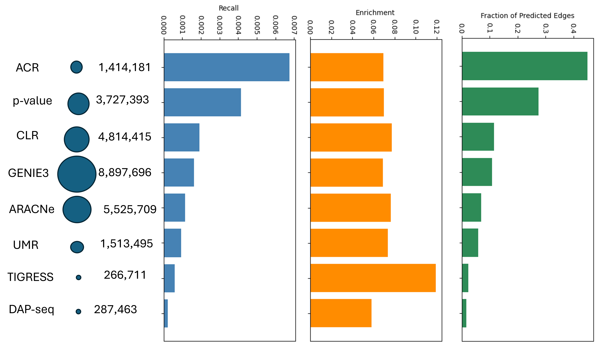
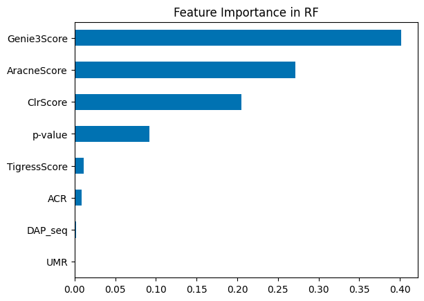
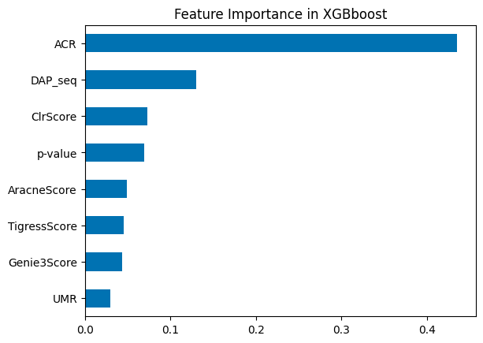
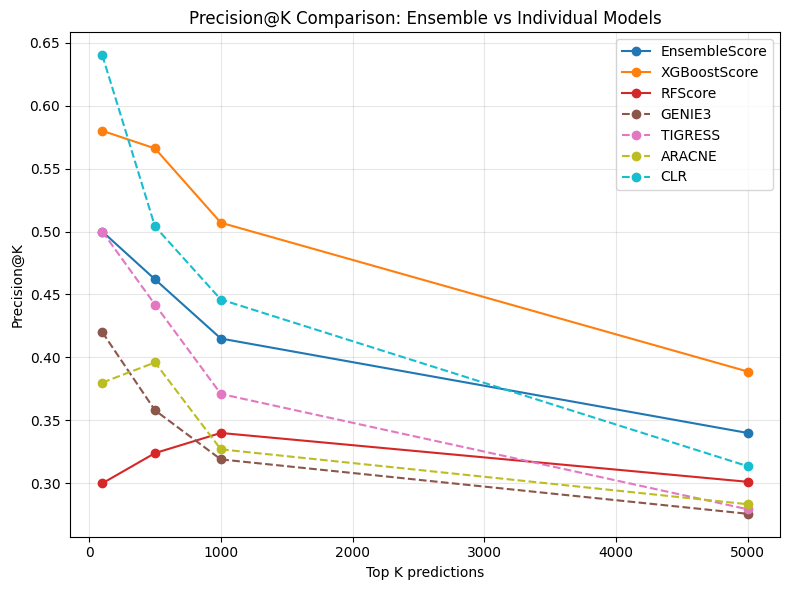

# Network Contribution

Fig 1. The recall (blue), enrichment (orange), and contribution of each input feature to predicted GRN Edges in RF

Fig 2. The recall (blue), enrichment (orange), and contribution of each input feature to predicted GRN Edges in XGBoost

# Feature Importance

Fig 3. Feature Importance of RF

Fig 4. Feature Importance of XGBoost

# Precision-Recall 

Fig 5. Comparison of the precision of the ensemble models vs the individual models

Fig 6. Comparison of the recall of the ensemble models vs the individual models

From Figures 5 and 6, we can observe that among the three models evaluated, XGBoost consistently delivered the best overall performance. It demonstrated higher precision and recall than the individual models, suggesting that the ensemble approach improved the prediction precision of GRNs predicted. Additionally, from Figure 3 and 4, we can suggest that RF emphasizes co-expression signals; data that is largely present, whereas XGBoost integrates structural and epigenomic features more effectively by capturing subtle signals from the sparse data. This explains why it performs better (has higher precision-recall than the other two models.

In conclusion, the idea of combining transcriptomic, epigenomic, and sequence-based features into machine learning frameworks in this study has shown promise, particularly in version 5 of Zea maize genes, highlighting that data integration enhances network inference compared to single-source approaches 

